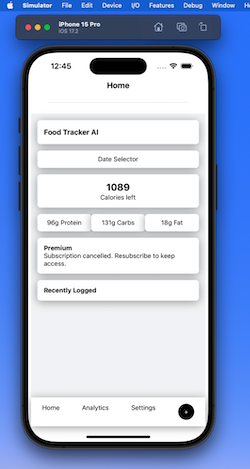

Here's your updated README with clearer instructions for switching between development builds and Expo Go:

---

# Food-Frame 🍽️

Food-Frame is an AI-powered calorie tracker built with [Expo Router](https://expo.github.io/router/).

## 📸 Screenshot



## 🚀 Getting Started

### 1. Install Dependencies

```bash
npm install
```

### 2. Start the App

#### Development Build:

If you are using a development build, start the app with:

```bash
npx expo start -c  # Clear cache and start Expo
```

Then press:

- **`s`** to switch between **development build** and **Expo Go**
- **`a`** to run on an **Android emulator**
- **`i`** to run on an **iOS simulator**

Alternatively, you can directly start with Expo Go:

```bash
npx expo start --go
```

#### Running on Specific Platforms:

For iOS:

```bash
npm run ios
```

For Android:

```bash
npm run android
```

For Web:

```bash
npm run web
```

## 🔧 Environment Variables

Create a `.env` file in the root of your project and add the following variables:

```env
EXPO_PUBLIC_SUPABASE_URL=https://ntlrvyityzcfctnivepr.supabase.co
EXPO_PUBLIC_SUPABASE_ANON_KEY=your_supabase_anon_key
EXPO_PUBLIC_OPENAI_API_KEY=your_openai_api_key
```

Replace `your_supabase_anon_key` and `your_openai_api_key` with your actual keys.

## 📚 Tech Stack

- **Expo Router** - Navigation for React Native apps
- **Supabase** - Backend as a service
- **OpenAI** - AI-powered food recognition

## 📌 Features

- AI-based food recognition
- Calorie tracking
- User authentication (Supabase Auth)
- Real-time data sync

## 🛠️ Development

- Clone the repo:
  ```bash
  git clone https://github.com/your-repo/food-frame.git
  cd food-frame
  ```
- Install dependencies:
  ```bash
  npm install
  ```
- Start the app:
  ```bash
  npx expo start -c
  ```
- If needed, switch to **Expo Go** by pressing `s`, or use:
  ```bash
  npx expo start --go
  ```

## 🤝 Contributing

Contributions are welcome! Feel free to submit issues or pull requests.

## 📜 License

[MIT License](./LICENSE.md)

---

This version makes it clear how to switch between Expo Go and a development build. 🚀
